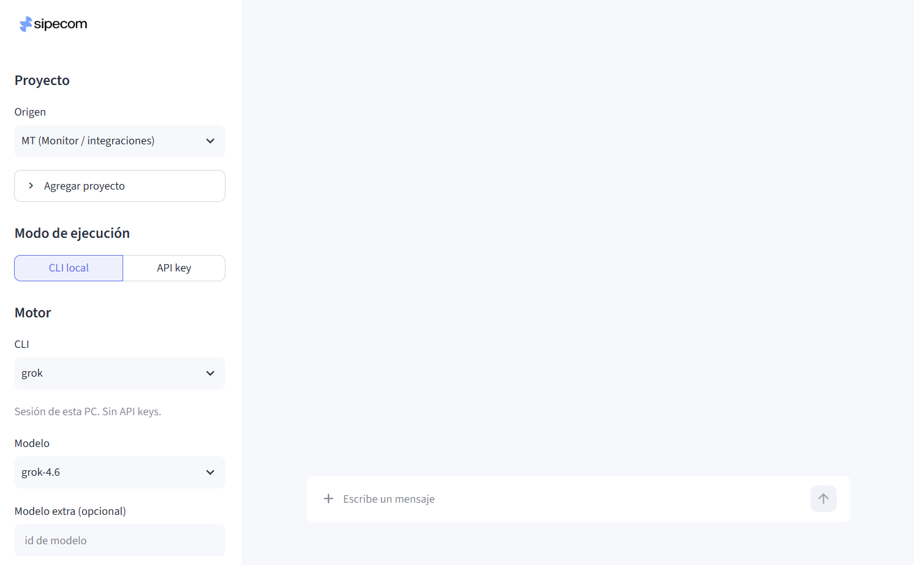

# SIPECOM-SOPORTE

CLI y consola local para consultar proyectos indexados (CodeGraph + Repomix) usando los agentes instalados en la PC.

La UI vive en **localhost**. No hay túnel ni exposición a internet.



## Qué es

`sipecom-soporte` es un producto Python instalable con `uv`:

1. Valida las herramientas de soporte (`doctor`).
2. Detecta las CLIs de agente **grok**, **antigravity** (`agy`) y **codex**.
3. Lista los **modelos reales** de cada CLI (no hay catálogo hardcodeado).
4. Abre el dashboard Streamlit en `http://127.0.0.1:2121`.

Las consultas del chat se lanzan con esos binarios locales. No se pegan API keys al motor CLI.

## Requisitos

- Python 3.11+
- [uv](https://docs.astral.sh/uv/)
- Al menos una CLI de agente: Grok, Antigravity o Codex
- CodeGraph, Repomix y Archify para el doctor 4/4 (el dashboard abre igual si el doctor no está 4/4)

## Instalación

```text
git clone https://github.com/kevin21sipecom/soporte-sipecom.git
cd soporte-sipecom
uv sync
```

## Inicio rápido

```text
uv run sipecom-soporte
uv run sipecom-soporte doctor
uv run sipecom-soporte models
uv run sipecom-soporte select --use grok,antigravity,codex
uv run sipecom-soporte dashboard
```

Abre **http://127.0.0.1:2121**. Solo escucha en loopback.

## Comandos

| Comando | Descripción |
| --- | --- |
| `sipecom-soporte` | Banner + doctor |
| `sipecom-soporte doctor` | Valida CodeGraph, Repomix, Archify y agentes |
| `sipecom-soporte models` | Modelos y effort que reporta cada CLI |
| `sipecom-soporte select --use grok,codex` | Guarda qué agentes usar |
| `sipecom-soporte config` | Muestra puerto y agentes |
| `sipecom-soporte dashboard` | Consola Streamlit en localhost:2121 |
| `sipecom-soporte ui` | Alias de `dashboard` |

`--port` cambia el puerto (por defecto 2121).

## Agentes y modelos

CLIs válidas: **grok**, **antigravity**, **codex**.

Al elegir una CLI, la consola pregunta a ese binario qué modelos tiene:

| CLI | Binario | Cómo se listan los modelos | Cómo se ejecuta |
| --- | --- | --- | --- |
| grok | `grok` | `grok models` | `--prompt-file` |
| antigravity | `agy` | `agy models` | `--print` |
| codex | `codex` | `codex debug models` | `codex exec` |

El listado se cachea unos minutos. Fuerza recarga con `sipecom-soporte models --refresh`.

Documentación de agentes: [docs/agentes.md](docs/agentes.md).

## Configuración

Archivo: `~/.soporte-sipecom.json` (puerto y agentes elegidos).

Catálogo de proyectos: `~/.soporte-sipecom/catalogo.yaml`.

## Documentación

| Documento | Contenido |
| --- | --- |
| [docs/README.md](docs/README.md) | Índice |
| [docs/instalacion.md](docs/instalacion.md) | Instalación y doctor |
| [docs/cli.md](docs/cli.md) | Referencia de comandos |
| [docs/dashboard.md](docs/dashboard.md) | Consola local |
| [docs/agentes.md](docs/agentes.md) | Grok, Antigravity, Codex |
| [docs/arquitectura.md](docs/arquitectura.md) | Módulos y flujo |

## Licencia

Uso interno SIPECOM salvo que el repositorio declare otra.
